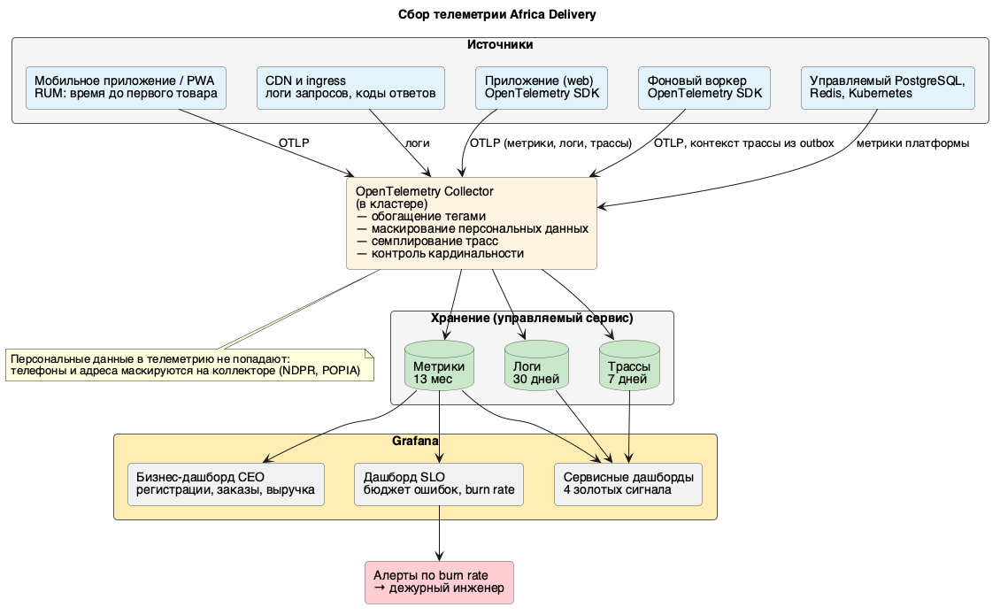

# Стратегия наблюдаемости

## Зачем это нужно и что считается достаточным

Наблюдаемость обслуживает SLO, а не собирает данные «на всякий случай». Каждая метрика либо входит в SLI одного из контрактов (`slo/`), либо помогает найти причину нарушения. Всё остальное не собирается: бюджет на наблюдаемость — 200 USD в месяц (NFR-OBS-03), а команда из шести человек не может тратить время на дашборды, которые никто не открывает.

Достаточной система наблюдаемости считается тогда, когда дежурный инженер за пять минут отвечает на четыре вопроса:

1. **Что сломано?** — какой сервис и какой сценарий нарушают SLO.
2. **Кого задело?** — сколько покупателей и заказов затронуто, в каких странах.
3. **Насколько срочно?** — с какой скоростью выгорает бюджет ошибок.
4. **Где смотреть дальше?** — ссылка из алерта ведёт в дашборд, оттуда в трассу, из трассы в лог конкретного запроса.

Соответственно, обнаружение нарушения SLO должно занимать не более 5 минут (NFR-OBS-01), а каждый алерт обязан иметь ссылку на инструкцию по разбору.

## Четыре золотых сигнала

| Сигнал | Метрика | Где снимается | Входит в SLI | Порог алерта |
| --- | --- | --- | --- | --- |
| **Задержка** | `http_request_duration_seconds` (гистограмма) по маршруту и коду ответа | приложение (OpenTelemetry) | Задержка каталога (`catalog.md`) | P99 каталога выше 300 мс в течение 10 мин |
| | `payment_confirmation_seconds` — от инициации до подтверждения | приложение | Подтверждение платежа (`payments.md`) | доля подтверждений за 10 мин ниже 95% |
| | `notification_dispatch_lag_seconds` — от события до передачи шлюзу | воркер | Своевременность уведомлений (`notifications.md`) | доля отправок за 5 мин ниже 99% |
| | Время до первого товара на устройстве (RUM) | мобильное приложение | NFR-PRF-01 | P75 выше 2,5 с за час |
| **Трафик** | `http_requests_total` по маршрутам; запросы к origin и доля, снятая CDN | ingress, CDN | знаменатель всех SLI доступности | рост к origin выше 200 запросов в секунду |
| | `orders_created_total`, `payments_initiated_total`, `notifications_sent_total` | приложение, воркер | бизнес-дашборд, знаменатель SLI | падение заказов в минуту более чем на 50% к профилю дня |
| **Ошибки** | доля ответов 5xx и таймаутов по маршрутам | ingress | Доступность каталога и приёма заказа | burn rate ×14,4 за 1 ч и ×6 за 6 ч |
| | `provider_errors_total` по провайдеру и коду (M-Pesa, Flutterwave, Sendbox, Sendy, шлюз SMS, WhatsApp) | приложение, воркер | внешняя зона ответственности в `payments.md` | доля ошибок провайдера выше 10% за 10 мин |
| | `reconciliation_mismatch_total` — расхождения при сверке | задача сверки | Целостность расчётов | любое расхождение (FM-01) |
| | `worker_task_failed_total`, размер очереди необработанных задач | воркер | Сохранность уведомлений | появление задач в DLQ |
| **Насыщение** | занятость пула соединений к БД, время ожидания соединения | приложение | причина отказов при пике (FM-04) | занятость выше 80% в течение 5 мин |
| | глубина очереди и возраст самой старой задачи | воркер | Своевременность уведомлений | очередь растёт 15 мин подряд (FM-06) |
| | доля попаданий в кеш и возраст ключа | приложение, Redis | NFR-AVL-06, ADR-002 | попадания ниже 80% или возраст выше TTL + 20% |
| | CPU и память относительно лимитов подов | Kubernetes | — | выше 85% лимита 10 мин |
| | остаток лимита у партнёрских API (rate limit) | приложение | — | остаток ниже 20% |

Первые три сигнала отвечают на вопрос «уже плохо?», насыщение — на вопрос «станет плохо через сколько минут?». Именно поэтому в списке есть глубина очереди, занятость пула и остаток лимита у партнёра: все три отказа из FMEA с высоким RPN (FM-04, FM-06, FM-09) проявляются сначала как насыщение и только потом как ошибки.

## Связь метрик с SLI и SLO

| SLO-контракт | SLI | Из каких метрик считается |
| --- | --- | --- |
| `slo/catalog.md` | Доступность каталога ≥ 99,95% | `sum(rate(http_requests_total{service="catalog",code!~"5.."}))` / `sum(rate(http_requests_total{service="catalog"}))` |
| | Доля быстрых ответов ≥ 99% | доля `http_request_duration_seconds` ниже 300 мс |
| `slo/payments.md` | Приём заказа ≥ 99,9% | `orders_created_total{result="accepted"}` / `orders_created_total` |
| | Подтверждение за 10 мин ≥ 98% | гистограмма `payment_confirmation_seconds` |
| | Расхождения ≤ 0,01% | `reconciliation_mismatch_total` / `payments_total` |
| `slo/notifications.md` | Передано шлюзу за 5 мин ≥ 99,5% | `notification_dispatched_total{lag_bucket="le_300s"}` / `notification_dispatched_total` |
| | Потери = 0 | сверка очереди и журнала отправок |

Расчёт SLI ведётся предвычисляемыми правилами (recording rules), чтобы дашборд SLO открывался мгновенно, а не считал агрегаты по сырым данным при каждом обновлении.

## Логи

Формат — структурированный JSON, одна запись на событие. Обязательные поля: время, уровень, сервис, `trace_id`, `span_id`, идентификатор заказа, псевдонимизированный идентификатор пользователя, имя провайдера и ключ идемпотентности для платёжных операций.

**Персональных данных в логах нет.** Телефоны, адреса и данные документов маскируются на коллекторе до отправки в хранилище (NDPR, POPIA). Это не только требование регулятора, но и практическая мера: иначе хранилище логов само становится базой персональных данных и подпадает под требование локализации, что удваивает стоимость (см. Task4).

Уровни: `error` — нарушение сценария, требует разбора; `warn` — сработала защита (предохранитель разомкнут, повтор запланирован); `info` — бизнес-события (заказ создан, оплата подтверждена, выдача в пункте). Отладочный уровень в проде выключен и включается точечно по флагу на конкретный сервис.

Хранение — 30 дней (NFR-OBS-03), чего достаточно для разбора инцидентов и месячного цикла отчётности по SLO.

## Распределённая трассировка

Трассировка на OpenTelemetry покрывает путь: HTTP-обработчик → обращение к кешу → запрос к БД → внешний вызов провайдера → запись в outbox → обработка задачи воркером.

Ключевая деталь: **контекст трассы передаётся через outbox**. Запись задачи содержит `trace_id`, поэтому работа воркера (отправка уведомления, передача заказа в доставку) отображается в той же трассе, что и исходный запрос покупателя. Без этого трасса обрывается на границе синхронной и асинхронной частей, и именно в этом месте живёт большинство наших отказов.

Семплирование: 100% ошибочных и медленных запросов, 1% успешных (NFR-OBS-02). Хранение — 7 дней. Такая схема даёт полную картину по инцидентам при затратах, укладывающихся в бюджет.

## Инструменты

| Слой | Решение | Почему так |
| --- | --- | --- |
| Сбор в приложении | OpenTelemetry SDK (Go) | Единый стандарт для метрик, логов и трасс; не привязывает к поставщику (NFR-OPS-02) |
| Транспорт и обработка | OpenTelemetry Collector в кластере | Место для маскирования персональных данных, семплирования и контроля кардинальности до отправки наружу |
| Хранение и визуализация | Управляемый сервис с совместимым с Prometheus хранилищем метрик, хранилищем логов и трасс + Grafana | Самостоятельная эксплуатация Prometheus, Loki и Jaeger требует людей, которых нет (ADR-001, CN.MSV.01) |
| Алертинг | Правила по скорости выгорания бюджета, оповещение дежурного | Алерт на симптом, а не на причину |

Замена поставщика хранения не затрагивает приложение: протокол OTLP и запросы на языке Prometheus переносимы, меняется только конфигурация коллектора.

## Управление стоимостью и кардинальностью

Наблюдаемость — статья расходов, которая растёт быстрее трафика, если её не ограничивать. Меры:

- запрещены метки с высокой кардинальностью: идентификаторы заказа, пользователя и сессии не попадают в метрики — они живут в логах и трассах;
- сроки хранения: метрики 13 месяцев (для сравнения год к году), логи 30 дней, трассы 7 дней;
- алерт при расходе 80% бюджета на наблюдаемость (NFR-OPS-06);
- при превышении первым сокращается семплирование успешных трасс, последними — SLI-метрики.

## Схема сбора

Исходник: [observability-pipeline.puml](observability-pipeline.puml).

## Дашборды и дежурство

| Дашборд | Для кого | Содержание |
| --- | --- | --- |
| Обзор SLO | дежурный, архитектор | Текущее значение SLI, остаток бюджета ошибок, скорость выгорания по трём сервисам |
| Сервисные | разработка | Четыре золотых сигнала по каждому модулю и по каждой партнёрской интеграции |
| Бизнес-дашборд запуска | CEO и инвестор | Регистрации, заказы, выручка, обновление раз в минуту (арт. 2) |

Порядок разбора инцидента: алерт по скорости выгорания → дашборд SLO (какой сервис и сколько бюджета осталось) → сервисный дашборд (какой из четырёх сигналов отклонился) → трасса неудачного запроса → лог по `trace_id`. Каждый алерт содержит ссылку на инструкцию с этим порядком и с известными паттернами защиты из FMEA.

## Assumptions

- Конкретный поставщик управляемого хранения телеметрии не зафиксирован: выбор делается при открытии облачного аккаунта (вопрос Q5 в `Task1/open-questions.md`) и ограничен суммой 200 USD в месяц.
- Дежурство в пилоте — в рабочие часы с эскалацией; круглосуточное дежурство отложено до пересмотра уровня доступности (ADR-002).
- Бизнес-дашборд обновляется раз в минуту из реплики базы, а не из аналитического хранилища: отдельное хранилище появится при переходе к варианту B.
